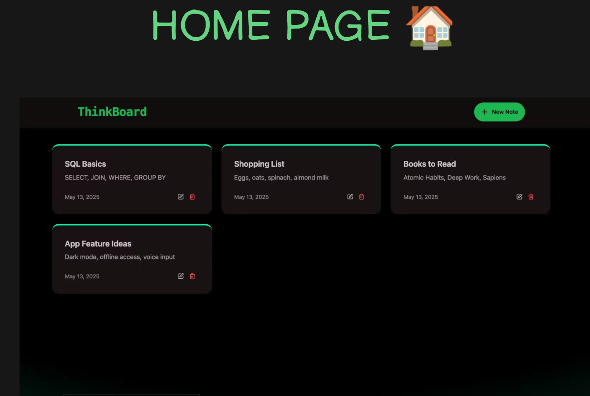
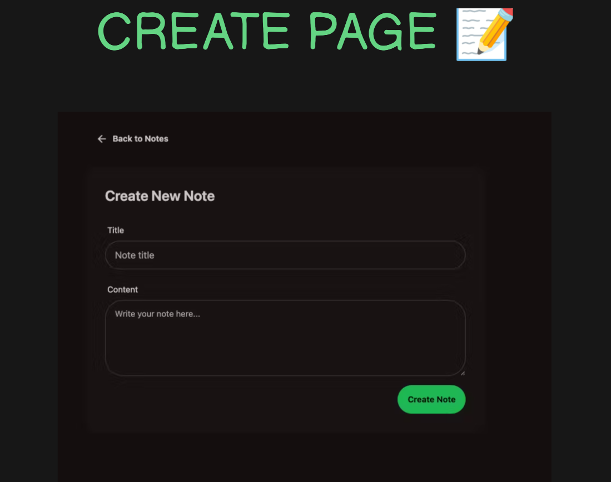
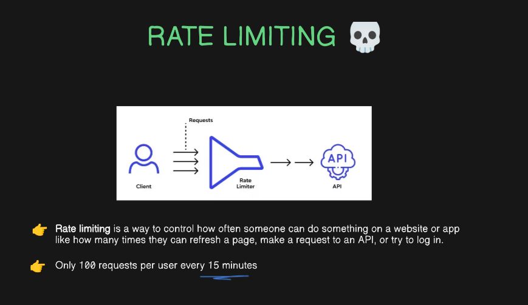
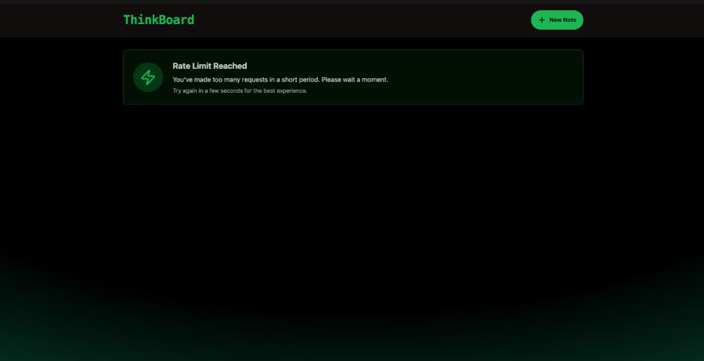

# 🧠 Thinkboard App

An interactive **Thinkboard** built with the **MERN Stack**, designed to help users brainstorm, visualize, and organize their thoughts through an intuitive board-based interface.

---

## ⚙️ Tech Stack

- **Frontend**: React.js (with Vite) + Tailwind CSS  
- **Backend**: Node.js + Express.js  
- **Database**: MongoDB  
- **Styling**: Tailwind CSS  
- **Build Tool**: Vite  
- **Package Manager**: npm

---

## 🚀 Features

- 📌 Create and visualize boards
- 🧠 Interactive idea-mapping interface
- ⏱️ Demo of API rate limiting
- ⚡ Fast Vite-powered React app
- 🌐 RESTful backend with MongoDB

---

## 📸 Screenshots

### 🏠 Homepage



---

### 📝 Create Page



---

### 🧪 Demo Interaction


---

### ⚙️ Rate Limiting



---

### 🚧 Rate Limit Demo



---

## 📦 Installation & Running Locally

### 1. Clone the Repository

```bash
git clone https://github.com/yourusername/thinkboard-app.git
cd thinkboard-app
